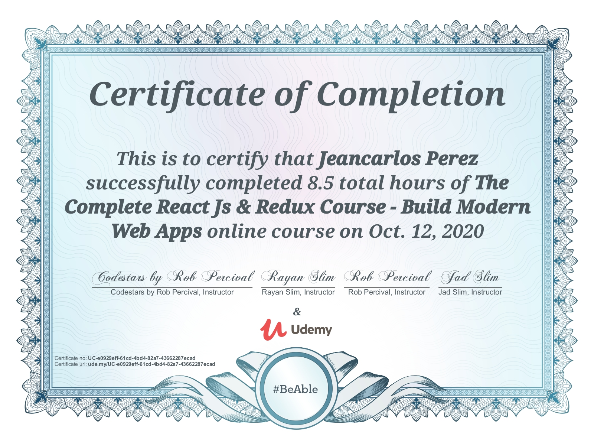

# The Complete ReactJS, Redux, & Firebase Course - Build Modern Web Apps

This is a Udemy Course I took and followed along to build an Instagram Like Web App with React 16, React Router, Redux & Firebase!

   

## Table of contents

- [Udemy Course](#udemy-course)
- [About](#about)
- [Projects](#project)
- [Skills Used](#skills-used)
- [Course Certification](#udemy-certification)
- [Setup](#setup)
- [Sources & References](#sources-&-references)
- [Scripts](#Scripts,-APIs-&-More)

## Udemy Course:

## About:

Master React and Redux in this fun and exciting course with top instructor Rayan Slim. With over 15,000 students, Rayan is a highly rated and experienced instructor who has followed my "learn by doing" style to create this amazing course.

You'll go from beginner to extremely high-level and your instructor will complete each task with you step by step on screen.

## Project

  

## Skills & Tools Used:

## Udemy Certification:

  

## Setup:

Go into the project directory.

1. Run `npm install`
2. Run `npm run dev`

## Sources & References:

### Media:

- Icons: https://icons8.com
- Photos: https://pexels.com
- Fonts & More: https://fontawesome.com

### Scripts, APIs & More:
